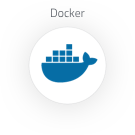
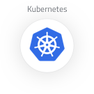
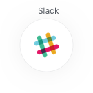

   

      

         

            <h2>Monitoring <b>.</b> Troubleshooting <b>.</b> Security</h2>
            Built on <a href="https://prometheus.io" target="_blank">Prometheus</a> and <a href="https://grafana.com" target="_blank">Grafana</a>
            

                <a href="#how-form" class="button">GET 3 MONTHS FREE TRIAL MONITORING & ALERTING SERVICE</a>
            

         

      

   

     

        

            

                

                   <i class="fa fa-flask"></i>
                      
                    <h4> Dimensional data</h4>
                    
<a href="https://prometheus.io" target="_blank">Prometheus</a> implements a highly dimensional data model. Time series are identified by a metric name and a set of key-value pairs.

                

                

                   <i class="fa fa-line-chart"></i>
                      
                    <h4> Great visualization</h4>
                    
<a href="https://prometheus.io" target="_blank">Prometheus</a> has multiple modes for visualizing data: a built-in expression browser, <a href="https://grafana.com" target="_blank">Grafana</a> integration, and a console template language.

                

                

                   <i class="fa fa-database"></i>
                      
                    <h4>  Efficient storage</h4>
                    
<a href="https://prometheus.io" target="_blank">Prometheus</a> stores time series in memory and on local disk in an efficient custom format. Scaling is achieved by functional sharding and federation.

                

            

            

                

                   <i class="fa fa-cog"></i>
                      
                    <h4>  Simple operation</h4>
                    
Each server is independent for reliability, relying only on local storage. Written in Go, all binaries are statically linked and easy to deploy.

                

                

                   <i class="fa fa-warning"></i>
                      
                    <h4> Precise alerting</h4>
                    
Alerts are defined based on Prometheus's flexible PromQL and maintain dimensional information. An alertmanager handles notifications and silencing.

                

                

                   <i class="fa fa-code"></i>
                      
                    <h4>Many client libraries</h4>
                    
Client libraries allow easy instrumentation of services. Over ten languages are supported already and custom libraries are easy to implement.

                

            

        

    
  

 

   

    

        

                

                    <h2>Prometheus and Grafana</h2>
                

        

        

            
        

        

            
        

        

          
We use the world’s most popular open source monitoring and troubleshooting technologies as a service on the cloud. We help you for Scalability, Availability and assured Security.

        
  
    

   

   

    

        

                

                    <h2>FAQs</h2>
                

        

        

            

                

                    <i class="dropdown icon"></i>
                Why should I pay for your solution, I can setup my own Prometheus and Grafana?
                

                

                    

                        1. We will provide hosting for your Prometheus and Grafana setup. You only need to have different exporters installed on your applications to be monitored. 
                        2. We will provide you 30 min solution if anything misbehaves on your machines. 
                        3. We will get you in touch with our Solution Architect who will help you to fine tune your infrastructure. 
                        4. We retain your metrics data for 15 days.
                    

                

                

                    <i class="dropdown icon"></i>
                   What can I monitor using your service?
                

                

                    
We are using Prometheus to collect different metrics of your application. Grafana is helping to present these collected metrics. Prometheus has hundreds of open source exporters which can be used to monitor different component of your application. We also provide help to instrument insights of your application. Cost for custom solution is $75/hour.

                

                 

                    <i class="dropdown icon"></i>
                    How long is the trial period?
                

                

                    
The trial period is 3 months after activating your account. We will host your metrics on our resources.

                

                 

                    <i class="dropdown icon"></i>
                How does ABCDevOPs pricing model work?
                

                

                    
Contrary to other competing products, our pricing model is quite simple. We charge $50/month/server. default retention period is 15 days.

                

                 

                    <i class="dropdown icon"></i>
                Do you charge for data storage?
                

                

                    
No, We don’t charge anything extra for data storage.

                

                 

                    <i class="dropdown icon"></i>
                Do you provide custom support?
                

                

                    
Yes, we do. You can contact us via email <a href="mailto:support@abcdevops.com" data-action="call" class="">support@abcdevops.com</a>. We reply within 1h for support inquiries. We also have slack channel. Sign up at <a href="https://abcdops.slack.com" target="_blank">https://abcdops.slack.com</a>

                

                 

                    <i class="dropdown icon"></i>
                Can I increase retention period of my data?
                

                

                    
Yes, Be in touch with us to discuss this further. We can be reached at <a href="mailto:support@abcdevops.com" data-action="call" class="">support@abcdevops.com</a>

                

            

        

    

   

   

    

        

                

                    <h2>Modern</h2>
                    
Works with your technology stack with out-of-the-box integrations with cloud, containers, incident management platforms, and more. ABCDevOps offers easy setup and built-in integrations with any data source using <a href="https://prometheus.io" target="_blank">Prometheus</a> and <a href="https://grafana.com" target="_blank">Grafana</a>.

                

        

        

            

                

                    

                        

                            
 

                            
 

                            
 

                            
 

                            
 

                            
 

                        

                        
 
                            
                        

                    

                

            

        

    

   

    

        

            <iframe src="https://docs.google.com/forms/d/e/1FAIpQLSe3f4Eq1LcJQarQ1snsSLna900VQY4t1lPD1KOd5BW6zQRKjQ/viewform?embedded=true"  height="1380" frameborder="0" marginheight="0" marginwidth="0" style="width:100%;">Loading...</iframe>
        

    

  
